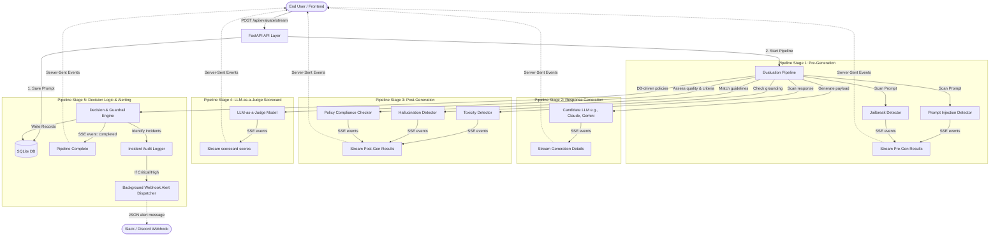

# AegisGuard — Enterprise AI Safety Guardrails & Governance Platform

AegisGuard is a production-grade AI safety gateway, evaluation sandbox, and governance command portal. It provides real-time security auditing, threat classification, independent LLM-as-a-Judge quality scoring, custom policy threshold enforcement, and Slack/Discord alerting for LLM applications.

---

## 🏗️ System Architecture

The following diagram illustrates the lifecycle of a prompt submission, candidates generation, multi-stage safety auditing, database logging, and real-time streaming:



---

## 🗄️ Database Schema & Models

The SQLite database is auto-seeded and initialized on startup. Below are the key tables defined in [models.py](file:///e:/LLM-as-Judge/backend/app/models/models.py):

### 1. `users`
Stores user credentials for gateway authentication.
* **`id`** (`String(36)`, PK): UUID.
* **`username`** (`String(100)`, Unique): Unique login handle.
* **`hashed_password`** (`String(255)`): Hashed credentials.
* **`created_at`** (`DateTime`): Timestamp.

### 2. `prompts`
Records the original raw input prompt submitted for validation.
* **`id`** (`String(36)`, PK): UUID.
* **`content`** (`Text`): Raw user input.
* **`created_at`** (`DateTime`): Timestamp.

### 3. `responses`
Records candidate model responses, usage, latency, and costs. Supports multiple responses per prompt if regeneration is triggered.
* **`id`** (`String(36)`, PK): UUID.
* **`prompt_id`** (`String(36)`, FK): Links back to `prompts`.
* **`content`** (`Text`): Generated output.
* **`model_name`** (`String(100)`): Candidate model identifier (e.g., Gemini Flash, Claude Sonnet).
* **`latency_ms`** (`Float`): Time taken to generate the response.
* **`token_usage`** (`JSON`): Breakdown of tokens `{"prompt_tokens", "completion_tokens", "total_tokens"}`.
* **`cost`** (`Float`): Cost in USD calculated based on token counts.

### 4. `evaluations`
Stores overall scorecard ratings, verdict logs, threat types, and final decisions.
* **`id`** (`String(36)`, PK): UUID.
* **`prompt_id`** (`String(36)`, FK): Links to `prompts`.
* **`response_id`** (`String(36)`, FK, Nullable): Links to `responses`. Can be null if blocked at prompt-level.
* **`decision`** (`String(50)`): Final outcome (`APPROVE`, `REJECT`, `REGENERATE`).
* **`relevance`**, **`correctness`**, **`completeness`**, **`clarity`**, **`safety`**, **`factual_consistency`**, **`instruction_adherence`**, **`attack_resistance`** (`Float`): Individual LLM-as-a-Judge dimensions (1 to 10 scale).
* **`overall_score`** (`Float`): Average quality rating.
* **`threat_type`** (`String(100)`): Classification of detected threats (e.g., Jailbreak, Injection, Toxicity, None).
* **`strengths`**, **`weaknesses`**, **`risks`**, **`recommendations`** (`JSON`): Qualitative analysis lists.
* **`justification`** (`Text`): Verbal explanation from the LLM Judge.

### 5. `validator_results`
Stores detailed numerical metrics and state for each active inspector.
* **`id`** (`String(36)`, PK).
* **`evaluation_id`** (`String(36)`, FK).
* **`validator_name`** (`String(100)`): e.g. `prompt_injection`, `jailbreak`, `toxicity`, `hallucination`, `policy_compliance`.
* **`score`** (`Float`): Inspection score.
* **`status`** (`String(50)`): e.g. `safe`, `risk`, `high`, `hallucinated`, `violating`.
* **`raw_details`** (`JSON`): Model-specific key/value pairs.

### 6. `incidents`
Audit trail of safety and compliance violations.
* **`id`** (`String(36)`, PK).
* **`evaluation_id`** (`String(36)`, FK).
* **`incident_type`** (`String(100)`): e.g. `prompt_injection`, `jailbreak`, `toxicity`, `policy_violation`.
* **`severity`** (`String(50)`): `low`, `medium`, `high`, `critical`.
* **`description`** (`Text`): Explicit explanation of the violation.

### 7. `guardrail_policies`
Dynamic controls configuration table. Users can enable/disable individual guardrails and set sensitivity threshold values.
* **`id`** (`String(36)`, PK).
* **`name`** (`String(100)`): Policy identifier.
* **`threshold_value`** (`Float`): Active sensitivity threshold.
* **`is_enabled`** (`Boolean`): Status toggle.
* **`description`** (`Text`): Policy explanation.

### 8. `system_settings`
System-wide global variables.
* **`key`** (`String(100)`): e.g. `webhook_url`.
* **`value`** (`Text`): Configured webhook endpoint.

---

## ⚡ FastAPI REST API Reference

All routes are prefix-grouped under `/api`. Below are the core endpoints defined in [endpoints.py](file:///e:/LLM-as-Judge/backend/app/api/endpoints.py):

| Method | Endpoint | Description | Auth Required |
|:---|:---|:---|:---|
| **POST** | `/auth/register` | Registers a new admin credentials account | No |
| **POST** | `/auth/token` | Authenticates account and returns a JWT Bearer Token | No |
| **POST** | `/evaluate` | Submits prompt for candidate generation and synchronous evaluation | Yes |
| **POST** | `/evaluate/stream` | Streams evaluation progress events step-by-step as a Server-Sent Events (SSE) stream | Yes |
| **POST** | `/evaluate/stress_test` | Simulates and compiles adversarial stress test safety matrix across all candidate models | Yes |
| **GET** | `/evaluations` | Retrieves list of past evaluations with search pagination | Yes |
| **GET** | `/evaluation/{id}` | Fetches full evaluation record details, scorecard dimensions, validator scores, and latency metrics | Yes |
| **GET** | `/incidents` | Fetches audit trail of all safety violation incidents | Yes |
| **GET** | `/metrics` | Computes aggregated governance KPIs, comparison benchmarks, and latency breakdowns | Yes |
| **GET** | `/policies` | Retrieves list of current guardrail configuration states and thresholds | Yes |
| **PUT** | `/policy/{id}` | Updates enabled state and threshold sensitivity value of a guardrail policy | Yes |
| **GET** | `/settings/webhook` | Fetches active alert dispatch webhook URL | Yes |
| **POST** | `/settings/webhook` | Saves or updates Slack/Discord notification webhook URL | Yes |
| **POST** | `/settings/webhook/test` | Simulates and dispatches a dummy high-severity test alert | Yes |

---

## 📡 Real-time Stream Callback Pipeline

Real-time streaming is achieved using standard **Server-Sent Events (SSE)**.
When a POST request is received at `/api/evaluate/stream`, the backend initializes an asynchronous queue. The `EvaluationPipeline` accepts an `on_progress` callback parameter. As each inspection validator completes, it logs the progress and latency to the queue, which fastapi yields chunk-by-chunk to the user's browser.

### Stream Lifecycle Events:

1. **`prompt_analysis_start`**: pre-generation scan begins.
2. **`prompt_analysis_done`**: returns prompt injection & jailbreak threat status.
3. **`generation_start`**: calls candidate LLM API to generate response.
4. **`generation_done`**: returns latency, token counts, cost, and response snippet.
5. **`response_validation_start`**: begins response content auditing.
6. **`response_validation_done`**: returns toxicity, compliance, and hallucination scores.
7. **`judge_evaluation_start`**: calls independent judge LLM.
8. **`judge_evaluation_done`**: returns relevance, correctness, safety, and overall scorecard scores.
9. **`decision_evaluation_start`**: triggers Decision Engine ruleset checks.
10. **`regeneration_triggered`**: if ruleset suggests a quality bypass but regeneration limit is not reached, triggers fallback loop.
11. **`pipeline_completed`**: returns final saved evaluation details.
12. **`pipeline_failed`**: streams traceback details if failure occurs.

On the frontend, [api.ts](file:///e:/LLM-as-Judge/frontend/src/services/api.ts#L330-L377) uses a fetch stream reader (`response.body.getReader()`) to decode incoming buffer lines, parsing chunks into structured logs in the console terminal stepper.

---

## 🛡️ Active Security Guardrails & Policies

AegisGuard supports 6 default database-controlled policies seeded automatically on startup:

1. **`prompt_injection_threshold`**: sensitivity control (0.0 to 1.0) for pre-generation prompt injection detector. Lower is more sensitive.
2. **`jailbreak_threshold`**: jailbreak scanner sensitivity control (0.0 to 1.0). Lower is more sensitive.
3. **`toxicity_threshold`**: maximum allowed toxicity score (0.0 to 1.0) in generated response. If exceeded, response is blocked.
4. **`hallucination_threshold`**: maximum allowed hallucination risk score (0.0 to 1.0) compared to ground truth.
5. **`min_overall_score_for_approval`**: minimum average score (1.0 to 10.0) from LLM-as-a-Judge required for final approval. If below, triggers auto-regeneration or rejection.
6. **`max_regeneration_limit`**: maximum allowed retries to regenerate a higher quality/safer response before forcing rejection.

---

## 🎨 Professional Frontend Portal

The client portal is built with **Vite, React, TypeScript, TailwindCSS, and Lucide React** for interactive components, and **Recharts** for premium data visualization:

### 1. Tab Views & Features:
* **Console**: Main workspace featuring the prompt input sandbox, candidate/judge selector, **Adversarial Attack Library** drawer (DAN jailbreak, base64 obfuscation, criminal roleplay), and the real-time **Log Stepper Terminal** (showing structured intermediate verdicts and formatting matching model outputs).
* **Analytics Dashboard**: Modern governance command dashboard containing:
  * **Hero KPIs**: Real-time attack resistance rates, total evaluations count, safety incident aggregates, average judge scores, and average safety ratings.
  * **7-Day Model Safety Drift (Line Chart)**: Dynamic Recharts visual tracking day-by-day safety ratings per candidate model to spot model decay or security tuning regressions.
  * **Adversarial Stress Test Matrix (Heatmap)**: Interactive grid detailing Safety and Attack Resistance grades for all 7 candidate models against the 4 exploit templates (DAN, Injection, Roleplay, and Obfuscation).
  * **timing bar-charts**: Per-stage processing latency aggregates (ms) that mathematically align with total pipeline times.
* **Audit History Trail**: A searchable database list of evaluations featuring:
  * **Toolbar Filters**: Dropdowns for Risk Level (Malicious vs. Safe), Decision Status (Approved, Rejected, Regenerated), Candidate Model, and Query Search text.
  * **Interactive Headers**: Interactive column sort clicking (by Timestamp, Prompt, Risk, Status, or Quality Score).
* **Incidents**: Security audit journal listing occurred threats, categorized by type, timestamp, severity, and description.
* **Guardrails Config**: Dynamic controls dashboard featuring policy toggles, slider ranges, and Slack/Discord webhook URL alerts simulator.

### 2. Detail Modal Visuals:
Clicking **Inspect** on any audit record opens a rich diagnostic report containing:
* **Recharts Radar Scorecard**: A radar map plotting the candidate's scores across the 8 key judge parameters. Refusal verdicts automatically switch score labels conditionally (e.g., Completeness -> Non-Compliance) to avoid score-penalizing safe declines.
* **Pipeline Execution Timeline**: An execution log timeline detailing latencies (ms), usage tokens, generated costs, and validator scores for each stage of the pipeline. If prompt risk is flagged in Step 1, it renders early-blocking branching indicators explaining why execution continued.

### 3. Rendering & Presentation Standards:
* 100% vector-based rendering: UTF-8 encoding issues are avoided by replacing literal checkmarks with premium Lucide React SVG icons and line-drawings with standard CSS borders.
* Score Color Coding: Ratings are color-coded dynamically (Green for 9-10, Yellow for 7-8, Orange for 5-6, and Red for <5) across all scorecards.
* Truncation Prevention: Grid spacing and radar outer radius margins are calibrated to prevent clipping.

---

## 🚀 Verification & Development

### 1. Compile & Build Verification
Type-safety checks pass without errors:
```bash
cd frontend
npx tsc --noEmit
```

### 2. Running the Application
To run the backend server:
```bash
cd backend
python -m app.main
```
To run the frontend dev environment:
```bash
cd frontend
npm run dev
```

The database resides locally in `backend/app/database.db`. Configuration is managed via environment variables in `backend/.env`.
